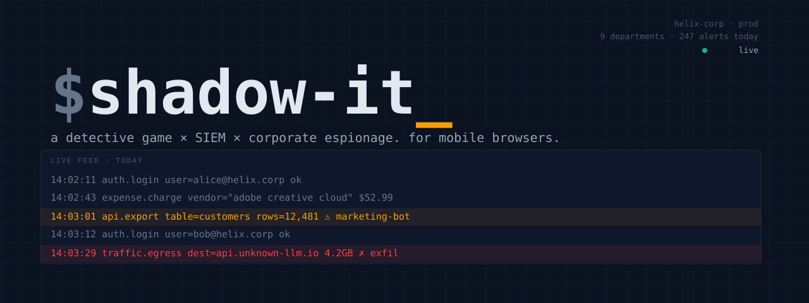

<p align="center">
  
</p>

# shadow-it

> A mobile-browser detective/strategy game where you play head of governance & security at a fast-growing tech company. Departments break the rules behind your back. You catch them — or you don't.

**Papers Please × Splunk × office politics, in 3-minute commute sessions.**

## What is it?

You are the new VP of Governance & Security at *Helix Corp*. Behind your back, departments are spinning up unsanctioned cloud, piping customer data into unauthorized AI tools, exposing internal APIs, and leaking secrets. Your job is to investigate anomalies across **logs, emails, expenses, and network traffic** — cross-reference the four lenses to build cases, then decide: ignore, warn, escalate, or terminate.

Each call shifts board trust, department morale, and the company-wide breach risk. Survive the quarter without a breach — or a mutiny.

## Core loop

1. **Triage** — swipe through alerts; most are noise, a few are real
2. **Investigate** — pull evidence from the four surfaces; each pull costs attention budget
3. **Connect dots** — pin clues to a case board, link them to form hypotheses
4. **Decide** — ignore, warn, escalate, terminate; every choice has consequences
5. **Debrief** — missed threats detonate later as breaches; false alarms breed resentment

## Status

Early prototype. The full quarter runs end-to-end: triage → pin → decide → debrief → next day, across five hand-authored cases (shadow AI, shadow cloud, accidental leak, exposed API, insider exfil). Meters compound across days. Trust at zero or risk at one hundred ends the run. Survive all five days for a win screen. State persists to IndexedDB.

Full design in [`SPEC.md`](SPEC.md). Operating notes for Claude Code in [`CLAUDE.md`](CLAUDE.md).

## Run it

```bash
npm install
npm run dev
```

Open the dev URL on your phone or in a narrow browser window. The app caps at 28rem wide — it's portrait-only on purpose.

## Stack (planned)

- **Frontend**: React + Vite + Tailwind, ships as a static PWA
- **State**: Zustand + IndexedDB
- **Hosting**: Cloudflare Pages / Vercel
- **No backend** for v1 — cases are authored as JSON in the repo

## Authoring with Gemma

Hand-authoring detective cases is expensive. Procedural generation at *runtime* makes patterns feel cheap. Middle path: use **Gemma 4 E4B** locally to draft hundreds of candidate cases — emails, log lines, expense justifications, department dialog — then hand-curate the best into the static dataset that ships with the game. LLM creative leverage at authoring time, deterministic gameplay at runtime.

## Roadmap

- [x] Game design spec
- [x] Vite + Tailwind scaffold
- [x] Triage inbox
- [x] Logs surface (filter + pin-to-case)
- [x] Case board (pinned clues view)
- [x] Decision UI + verdict logic (trust / risk / morale meters, 5 outcome tiers)
- [x] IndexedDB persistence (rehydrate on load, reset action behind confirm)
- [x] Five hand-authored cases (one per day, archetypes: shadow-ai, shadow-cloud, leak-accidental, exposed-api, insider-exfil)
- [x] Day-end flow + game-over (trust 0 / risk 100) + win (survive 5 days)
- [ ] Gemma case-authoring pipeline
- [ ] Emails surface (second investigation lens for cross-referencing)
- [ ] Expenses + Traffic surfaces (currently noise-only — referenced by alerts, no dedicated UI)
- [x] Persistence schema — partialize so content updates flow to returning players
- [ ] PWA polish + deploy
- [ ] Swipe gestures for triage (mobile polish — buttons-only for now)

## License

TBD.
